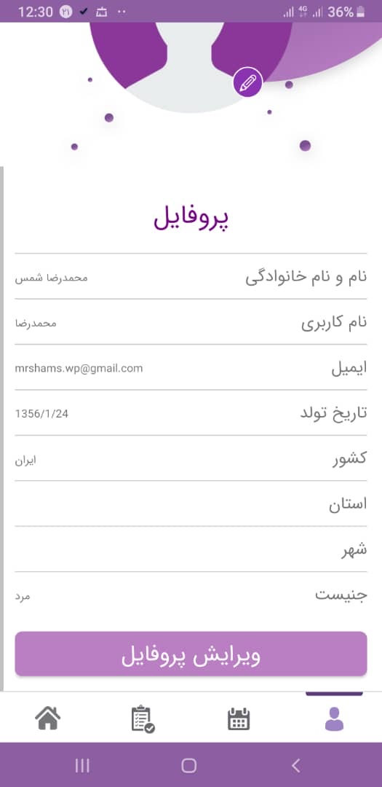
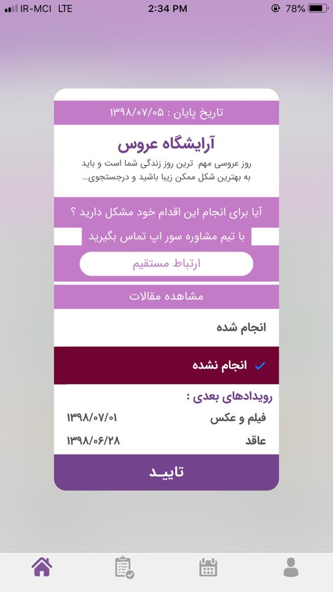
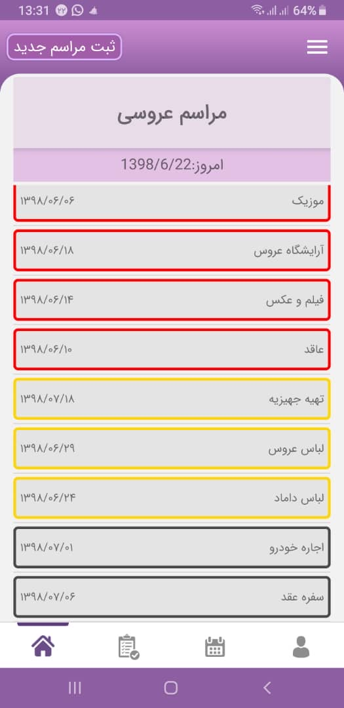
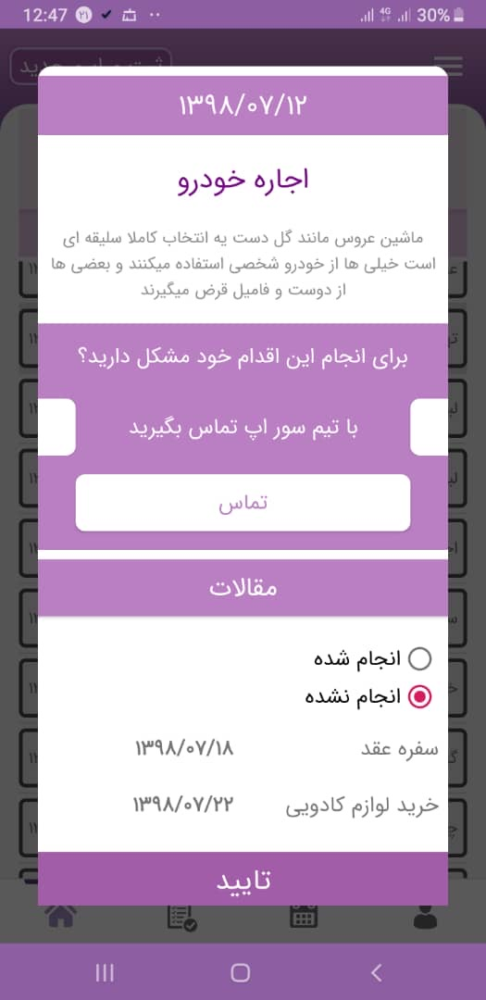
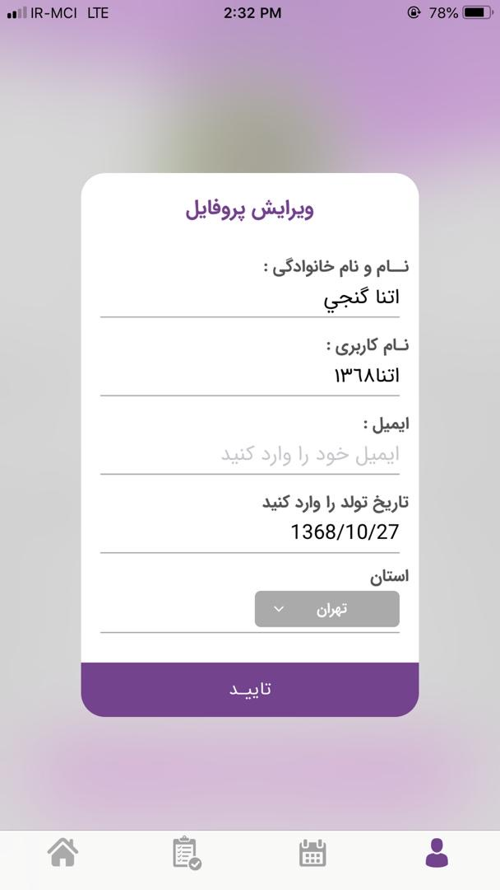
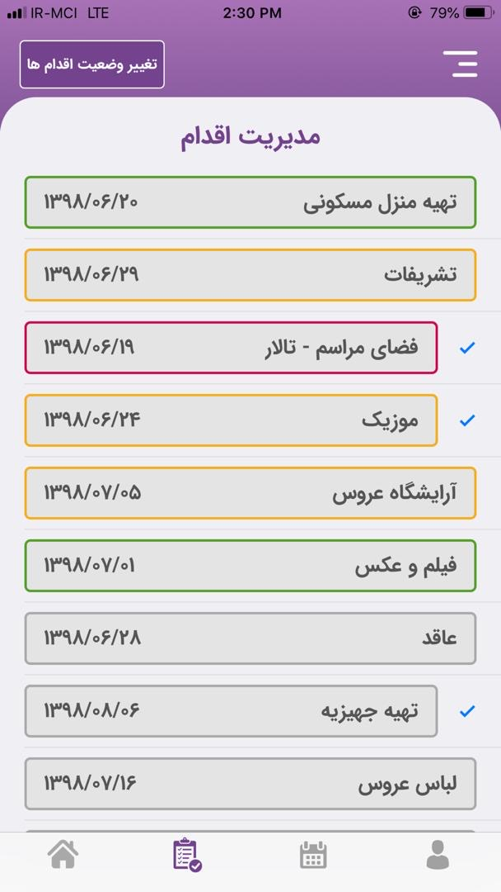

# 🎉 Wedding Planner App 💍

## 🌟 Overview
This project is a **wedding planning application** designed to help users **organize and manage** their wedding plans step-by-step. The application acts as both a **reminder** and a **service provider**, guiding users through **50 structured steps** from the beginning to the completion of their wedding planning.

## ✨ Key Features
- 📌 **Step-by-step guidance**: Users follow a structured plan consisting of 50 steps.
- ⏰ **Reminders**: Helps users stay on track with their wedding preparation.
- 🛍 **Service Integration**: Offers various wedding-related services at different stages.
- 📱 **Cross-platform**: Available on iOS and Android.
- ⚡ **Backend**: Built with Node.js.

## 🛠 Technology Stack
- 🖥 **Backend**: Node.js
- 🍏 **iOS**: Swift
- 🤖 **Android**: Kotlin

## 📸 Screenshots
Here are some screenshots of the project:

📄 [View the PDF Documentation](sketck.pdf)

1. 🏠 **Home Screen**
2. 📊 **Step Progress Tracking**
3. 🔔 **Task Reminder & Notifications**
4. 🛒 **Service Booking**
5. ✅ **Final Checklist**

(Screenshots will be included here)

## 🎯 Purpose
This project was developed as a **demo** to showcase the concept of a structured wedding planning app. The repository is being published on GitHub **for demonstration purposes only**. The main goal is to display a portion of the **source code** to showcase the **coding style and architecture**.

## 🏆 Contributors
- 👨‍💻 **Project Manager & Lead Developer (Backend & iOS)**: Sina Khanjani

## 📜 Notes
- ⚠ **This application is not available on any app store.**
- 🖼 **Screenshots are for demonstration only.**
- 🔍 **This project is purely for showcasing the source code and demo purposes.**

## 📜 License
This project is licensed under the **MIT License**.

For more details, feel free to contact the project owner. 🚀

